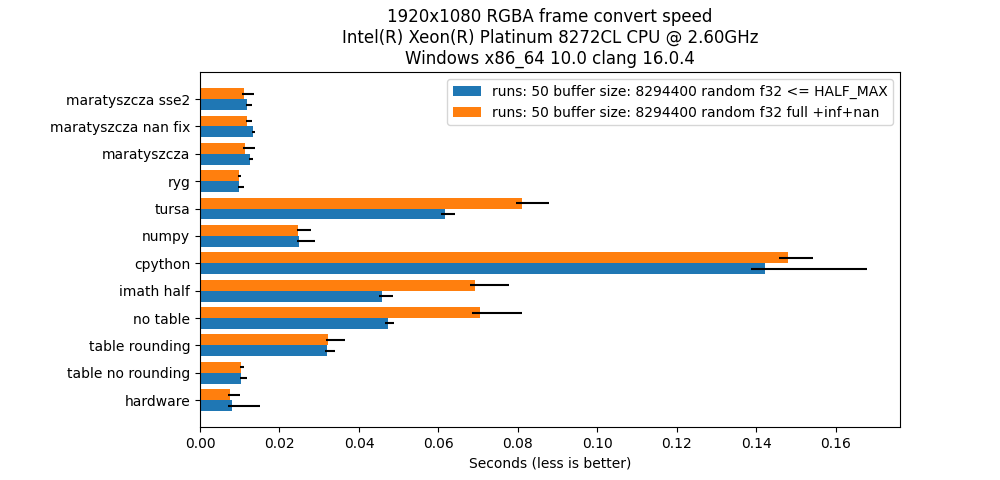
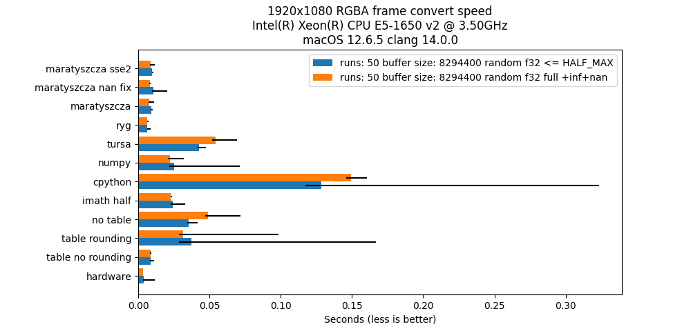
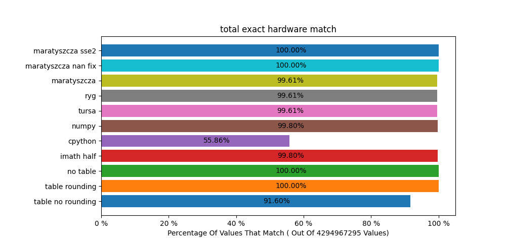

# Float2Half

A small program to test the performance and accuracy of various float to half float methods against hardware.

The table method is based on ffmpeg version of float2half, which is base on:

http://www.fox-toolkit.org/ftp/fasthalffloatconversion.pdf

An issue with the table method is it does not do any rounding.
The x86 f16c and arm f16 hardware instructions
use IEEE 754 round to the nearest, ties to even method by default.

The table method can also lose a float32 NaN value if the signaling bits are only in
the lower 13 bits of the mantissa.

`table_float2half_round` show a branchless way of rounding and retaining all NaNs.

Additional methods have been added from this article

https://www.corsix.org/content/converting-fp32-to-fp16

# Results

## Machines without fp16 support

I've only still have few CPUs that are old enough to not have not have fp16c instructions.
They are both macs and because of the OS version clang appears to be using SSE4 instructions
to vectorize the some of the implementations.

Getting more results from older machines is desirable. Also more AMD machines would be nice too.

## Machines with fp16 support

### Windows

### Linux

### macOS

## ARM with fp16 support

# Accuracy Compared To Hardware

